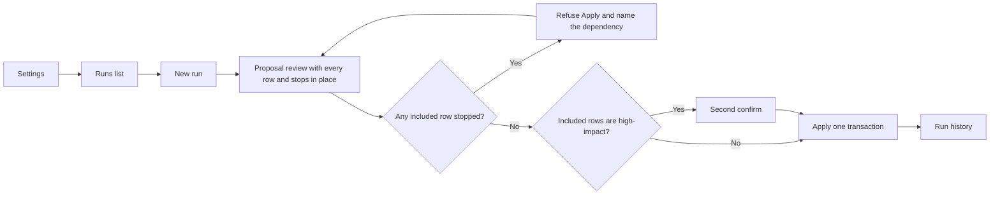

# UI review: Configuring agent step 1 (admin UX sketch)

**Date:** 2026-10-08  
**Status:** Sketch for Accept. Implement follows the packet gates (Brief + Design + Marc green-light).  
**Stem:** `configuring-agent-step1`  
**Spec base:** Wilhelmina — [PRD](../../internal/prd/configuring-agent/PRD.md), [spec](../../internal/specs/configuring-agent/SPEC.md), [design](../../internal/design/configuring-agent.md). Shipped operator steps: [manuals/configuring-agent.md](../../../manuals/configuring-agent.md).  
**Step 0 fold:** Wilhelmina [PR #148](https://github.com/Marc02130/nimblelims/pull/148) (tip `47b3a52`). QA bars are [SPEC §6](https://github.com/Marc02130/nimblelims/blob/47b3a52fdbb43ef00bd01f1c31d358648611e460/.docs/internal/specs/configuring-agent/SPEC.md#6-fail-bars-tobias) (D-1–D-9, L-1–L-4, FB-11). The needs-build list, including the L-A catalog-scope gap, is [SPEC §10](https://github.com/Marc02130/nimblelims/blob/47b3a52fdbb43ef00bd01f1c31d358648611e460/.docs/internal/specs/configuring-agent/SPEC.md#10-needs-build-where-shipped-pr-145-differs-from-the-locks-mathilda-2026-10-07). Those two sections are on that PR tip. The spec file in this tree is [SPEC.md](../../internal/specs/configuring-agent/SPEC.md). §6 and §10 land with PR #148.  
**Author:** Mathilda (NimbleLIMS UI review seat)  
**Gates:** Brief + Design + Marc green-light. This file is the UI sketch only. It does not Accept the packet and it does not open implement.  
**Persona:** Lab admin with existing permission `config:edit`. Scientist and admin words, not a chat product.  
**Not IC50. No product code in this file.**

Step 1 of the forward plan Marc approved on 2026-10-07: a lab admin can run the configuring agent for real. The agent reads lab inputs and proposes configuration. A person confirms. NimbleLIMS changes only through APIs that already exist.

The 2026-10-03 design called confirm-before-apply a preference. L-C was locked on 2026-10-04. The details came on 2026-10-07. This sketch follows that lock. It does not reopen it.

---

## Locks (Marc, 2026-10-07)

Do not reopen these.

1. No chat UI and no lab-analysis assistant. The agent takes lab inputs (SOPs, instrument output, CRO data, sample manifests, personnel) and applies configuration only through existing APIs.
2. Confirm-before-apply is a lock. Confirm happens **once per change set**, with a **per-row include/exclude** checkbox.
3. A **second confirm** is required when the included rows contain any of: roles/privileges changes, schema changes, Set inactive, container Amount → 0.
4. Apply is **one transaction** and applies **only the confirmed (included) rows**. All or nothing: if it fails, nothing is applied and the screen says why.
5. The agent may change any table the confirming user can. The person who confirms is responsible. The agent acts with that person's permissions (Tobias L-2, Marc-approved). Rows they lack permission for stay visible, greyed out and excluded, labelled with the missing permission. Never hidden or silently dropped. A row the confirmer lacks permission for can never be applied. When the starter and the confirmer are different people, re-evaluate the greyed rows when the confirm screen opens, for the person confirming. The starter is recorded only as the person who started the run.
6. **Self-escalation is always a stop**: any change that would grant the confirming user (or their role) new privileges becomes a Stop card, never a proposal row.
7. **No delete anywhere in the UI.** Removal shows as **Set inactive** (status flag); for containers, **Amount → 0**. A delete the agent wants becomes a Stop card.
8. Permission to use the configuring agent (Settings, start runs, confirm) stays **`config:edit`**. No new permission.
9. If no existing API can express a change, the agent stops and says so (Stop card). Schema shows a table only when it is usable through configuration. Lists and list items stay off Schema.

---

## Shipped today

PR 145 (`configuring-agent`, merge `189cc00`) put two screens and these routes on `main`. Cite them. Do not draw a third product that hides them.

**Pages**

| Screen | Route | File |
|--------|-------|------|
| Settings | `/admin/settings/configuring-agent` | `frontend/src/pages/admin/ConfiguringAgentSettings.tsx` |
| Run (name a configuration, add a file, proposal, apply) | `/admin/configuring-agent` | `frontend/src/pages/admin/ConfiguringAgentRun.tsx` |

Routes are registered in `frontend/src/App.tsx`. Both require `config:edit`. Without it, the route redirects to `/dashboard`. The Admin block in `frontend/src/components/MainNav.tsx` is not rendered unless `hasPermission('config:edit')` (`MainNavAdminSection`). There is no read-only configuring-agent view. Follow that pattern: **hidden**, not a greyed read-only page.

The client calls are in `frontend/src/services/apiService.ts`. The router is `backend/app/routers/configuring_agent.py`, mounted at `/v1` from `backend/app/main.py`. Every route uses `config:edit`. A missing permission returns **403** with `You can't change configuring-agent settings.`

| Method | Path | On screen today |
|--------|------|-----------------|
| GET, PUT | `/v1/configuring-agent/settings` | Provider and model. Changing provider clears the stored key and the model. |
| PUT, DELETE | `/v1/configuring-agent/settings/key` | Set key. Clear key (confirm dialog). The key is not returned. |
| GET | `/v1/configuring-agent/models?provider=` | Live model list for that provider. Server-side. |
| GET, POST | `/v1/configuring-agent/configurations` | Name and description, then a chip list. |
| GET | `/v1/configuring-agent/configurations/{id}` | Documents, ledger items, and earlier runs for one configuration. |
| POST | `/v1/configuring-agent/configurations/{id}/documents` | “Add lab file”. PDF, DOCX, TXT, CSV, MD, JSON. Empty file, no text, and over 10 MB stay as an error on the page. |
| POST | `/v1/configuring-agent/configurations/{id}/runs` | “Start run” plus optional goal note. |
| GET | `/v1/configuring-agent/runs/{id}` | Opens that run on the same page. |
| POST | `/v1/configuring-agent/runs/{id}/steps/{step_id}/accept` | **Accept** on each step. |
| POST | `/v1/configuring-agent/runs/{id}/steps/{step_id}/skip` | **Skip** on each step. |
| POST | `/v1/configuring-agent/runs/{id}/steps/{step_id}/redo` | **Redo** plus a feedback box. |
| POST | `/v1/configuring-agent/runs/{id}/apply` | **Apply accepted steps**. One transaction. Failure rolls back. |

There is no Test connection route. There is no runs-list route. Run rows nested on a configuration return `id`, `name`, `status`, `banner`, and `created_by`. They do not return a person name, a start time, or an input count (`configuration_payload` in `backend/app/services/configuring_agent_service.py`).

Step groups stored today are only `schema_tables`, `schema_columns`, `layouts`, `privileges`, `relations`, and `other` (`backend/app/services/configuring_agent_allow.py`). A step stores `target`, `action`, `why`, `decision`, `status`, `gap`, and `error_message`. It does not store a verb from the locked set, a before → after pair, or a source citation.

`start_run` stops at the first blocked step and does not keep later proposal rows. That halt is what the code does today. It is a CEO call (Rolf). Marc may overrule it. It is not a Marc lock. This sketch does not keep it: the proposal keeps every row, and each stop is shown in place. Keeping the later rows is **Needs build.** Apply posts steps whose `decision` is `accepted`, as the signed-in caller. A permission failure rolls the transaction back and returns **403**. It does not leave the other rows applied, and it does not grey the row out ahead of time.

Checked on `main` in `backend/app/services/configuring_agent_allow.py` (`_ALLOWED`). Five drop/delete routes are still callable. Removing them from `_ALLOWED` is the first build item:

- `POST /v1/schema/tables/{id}/drop`
- `POST /v1/schema/columns/{id}/drop`
- `DELETE /v1/schema/relations/{id}`
- `DELETE /lists/{list_id}`
- `DELETE /lists/{list_name}/entries/{entry_id}`

List `DELETE` in `backend/app/routers/lists.py` sets `active=False`, but the method is still delete. Those five must not be buttons or row verbs in this sketch.

Role delete and sample-type-transition DELETE are already absent from `_ALLOWED`. `DELETE /roles/{role_id}` and `DELETE /v1/sample-type-transitions/{row_id}` are not in the tuple, so a proposal that names them already stops. The tuple does include `POST /v1/sample-type-transitions` and `PUT /roles/{role_id}/permissions`.

`PATCH /containers/{container_id}/contents/{sample_id}` can set `amount` to 0 (`ContentsUpdate.amount` is `ge=0` in `backend/app/schemas/container.py`). That path is not in the agent allow-list. Schema deprecate sets status `deprecated` (`backend/app/services/ui_schema_service.py`). The admin-facing verb in this sketch is still **Set inactive**.

Run status values in code: `reading_inputs`, `proposing`, `applying`, `done`, `stopped`, `failed`. There is no `Waiting for you` and no label `Applied`.

---

## Screen flow



Settings is also linked from the run, as it is today (`Provider settings` on `ConfiguringAgentRun.tsx`). A run with no provider or no key sends the admin to Settings. It does not open a chat.

---

## 1. Settings

### Purpose

The admin picks one provider, one model from that provider’s live list, and a key. They can test that the connection works. This page does not chat and does not start a run.

### Who

`config:edit` only. Same gate as today. Lab techs do not get this page. A person without `config:edit` does not see the nav item. A direct URL redirects to `/dashboard`. The API text stays `You can't change configuring-agent settings.`

### Layout

Keep `/admin/settings/configuring-agent` and `ConfiguringAgentSettings.tsx`.

Top to bottom:

1. Title: **Configuring agent settings**.
2. One line: the key is stored encrypted and is not shown again.
3. Chip: **Key set** or **No key**. Already on the page.
4. Provider. Single select. Labels **OpenAI**, **xAI**, **Anthropic**. Stored values `openai`, `xai`, `anthropic`. Already on the page.
5. Model. Single select filled from `GET /v1/configuring-agent/models`. If the display name differs from the model id, show the id as secondary text. Already on the page.
6. **Save model**. Already on the page.
7. API key. `type="password"`, `autoComplete="off"`. Empty after a successful save. Helper: “Not shown after save.” Already on the page.
8. **Set key** and **Clear key**. Clear opens the existing confirm. The button says **Clear key**, not Delete.
9. **Test connection**. **Needs build.** No route and no button exist.

No chat box, no prompt, no test message, no streaming panel.

### States

| State | What the admin sees |
|-------|---------------------|
| Loading settings | Spinner. Already on the page. |
| No provider | Model, key, and Test connection stay disabled. |
| Changing provider | Model clears. Stored key clears. Models reload for the new provider only. Already in `save_provider_and_model`. |
| Loading models | “Loading models…”. Already on the page. |
| Models failed or empty | “Couldn't load models — check key or try again”. Save model stays disabled. Already on the page. |
| Key set / No key | Chip. Already on the page. |
| Test running | Button shows “Testing…”. **Needs build.** |
| Test passed | “Connected to {OpenAI, xAI, or Anthropic}.” **Needs build.** |
| Test failed | “Could not reach {provider}. Check the key and try again.” **Needs build.** |

### Copy

| Control | Copy |
|---------|------|
| Clear key confirm | “Clear the {provider} key? Configuring agent can't call that provider until a key is set again.” The selected model is cleared too. This dialog is already on the page. |
| Set key success | “Key saved.” Do not repeat the key. |
| Test connection | Pass and fail sentences above. The response does not include the key, a key prefix, or `OPENAI_API_KEY` / `XAI_API_KEY` / `ANTHROPIC_API_KEY` values. |

Missing-key errors from the models call may name the env variable, as the spec already requires. They still must not print the secret.

### Errors

Errors stay on this page. Do not navigate away.

| Case | Copy |
|------|------|
| Provider not one of the three | “Provider must be one of openai, xai, or anthropic.” Already returned by the API. |
| Key before provider | “Pick a provider before setting a key.” Already returned. |
| Models call failed | The page already shows the API detail. If that detail contains the key, strip it. **Needs build** for the strip. |
| Test connection failed | Lab sentence above. No key. **Needs build.** |

### Bounce list

- A chat box, prompt playground, or “send a test message”.
- A fixed model list that ignores the live models endpoint.
- The key shown after save, in the address bar, in a toast, or in the Test connection result.
- Test connection called from the browser with the key in the request the browser can read back. Models are already server-side (`models_for`). Test connection must work the same way.
- A **Delete** label on Clear key.
- Lab-tech access. The nav stays hidden without `config:edit`.

---

## 2. Runs list

### Purpose

The admin sees past and current runs and starts a new one.

### Who

`config:edit` only. Hidden with the rest of Admin when that permission is missing (`MainNav.tsx`, `App.tsx`). Do not build a read-only list for other roles.

### Layout

**Needs build** as its own table. Today, earlier runs are small buttons under the selected configuration on `ConfiguringAgentRun.tsx` (`{name} · {status}`). They do not show starter, time, or input count.

Place: Admin → Configuring agent (`/admin/configuring-agent`), above the run detail. **New run** is the primary button.

Columns:

| Column | Source today | Sketch |
|--------|----------------|--------|
| Run | `name` on the run | Keep |
| Starter | `created_by` is a user id on the payload, not a name | Person’s name. **Needs build.** |
| Started | `created_at` is on `configuration_runs` and is not in the list payload | Date and time. **Needs build.** |
| Inputs | Documents live on the configuration, not as a count on the run | Count of files on that run’s configuration. **Needs build.** |
| Status | See the map below | Lab labels. **Needs build** for the labels that the code does not use. |

Row click opens Proposal review while the run is waiting, and Run history after it is finished. The proposal keeps every row. Each stop is shown in place with its reason, so one run shows the whole gap list. `start_run` still breaks at the first stop and drops the later rows. That break is **Needs build.** Halt-at-first-stop is a CEO call (Rolf), not a Marc lock.

### States

Empty: “No runs yet.” Primary button: **New run**.

Status labels. Left column is what this sketch shows. Right column is the code value where one exists.

| On screen | Stored today |
|-----------|----------------|
| Reading inputs | `reading_inputs` |
| Proposing | `proposing` |
| Waiting for you | **Needs build.** Today the run stays `proposing` while the admin decides. |
| Applying | `applying` |
| Applied | **Needs build** as a label. Code status is `done`. |
| Stopped | `stopped` |
| Failed (apply rolled back) | `failed`. The server can already set `error_message` to “Apply failed and every change from this apply was undone.” |

Color is not the only cue. The word is on the row.

### Copy

Button: **New run**.  
Helper under the title: “Each run reads the files you attach and proposes configuration. Nothing changes until you apply.”

### Errors

List load failure stays on the page: “Couldn't load runs.” Retry button. **Needs build.** Today a failed `GET /configurations` is one Alert on the combined page.

### Bounce list

- A read-only list for someone without `config:edit`, or a nav item they can see.
- Status shown only as a color dot.
- A run that disappeared because it contained a stop.
- Chat, or a “ask the agent” box on this list.

### Gloved / high volume

**New run** is a large button (at least 48px tall), not a text link. The table row is a large click target. Status text is at body size. Keyboard: Tab to **New run**, Enter starts a run. Tab into the table, Enter opens the row.

---

## 3. New run

### Purpose

The admin attaches lab inputs, optionally types one line about the goal, and starts the run.

### Who

`config:edit` only. The starter is `created_by` on the run. That record is only who started it. Permission checks, the greyed rows, and the audit actor are the confirming user (Tobias L-2, Marc-approved; D-8). Today `start_run` and `apply_run` use the signed-in caller. Re-evaluating the greyed rows for the confirmer, when that person is not the starter, is **Needs build.**

### Layout

**Needs build** as its own step. Today it is the top of `ConfiguringAgentRun.tsx`: name, description, **Create**, then **Add lab file**, then a goal note, then **Start run**.

Keep a **Name**. `POST /v1/configuring-agent/configurations` already requires one (`A configuration needs a name.`). Files still belong to that named configuration. This sketch does not move files onto the person.

Fields, top to bottom:

1. **Name**. Required. This is the configuration name.
2. Attach inputs. Large drop area plus a button. Each file has a kind the admin can set: **SOP**, **Instrument output**, **CRO file**, **Manifest**, **Personnel list**. **Needs build.** The API stores `file_type` as `pdf`, `docx`, or text. It does not store those lab kinds.
3. List of attached files: name, kind, status (`ready` or the error).
4. **Goal**. Optional one line. Already `goal_note`. Helper: “One line. This is not a chat.”
5. **Start**.

Supported files stay PDF, DOCX, TXT, CSV, MD, and JSON. The picker on the page already uses that accept list. RTF stays refused.

### States

| State | Behavior |
|-------|----------|
| No files | **Start** disabled. “Add a lab file before starting a run. Empty input does not call the model.” Already returned by the API. |
| File not ready | **Start** disabled until a document status is `ready`. The page already disables Start that way. |
| No provider or no key | Start is refused. Link to Settings. Text already returned: “Pick a provider and a model under Configuring agent settings before starting a run.” |
| Reading inputs | After Start, status **Reading inputs**, then **Proposing**. |
| Started | Go to Proposal review for this run. |

### Copy

Drop area: “Drop a lab file, or choose one.”  
Kinds: SOP, Instrument output, CRO file, Manifest, Personnel list.  
Start button: **Start**.

### Errors

File errors stay on this page. They already do: `upload` sets an Alert and does not leave the page.

| Case | Copy already returned |
|------|------------------------|
| Empty file | “That file is empty.” |
| Over 10 MB | “File is larger than 10 MB.” |
| Wrong type | “Unsupported file type. Use PDF, DOCX, TXT, CSV, MD, or JSON.” |
| No text | “That file has no text to configure from.” |
| Duplicate configuration name | “A configuration with that name already exists.” |

Show that text next to the file or under the form. Do not clear the other files.

### Bounce list

- A chat thread, or a goal box that grows into a conversation.
- Start with no file.
- A file error that navigates away or that is only in a toast the admin can miss.
- Uploading as the person instead of the named configuration.

### Gloved / high volume

The drop area is a large target, not only the current small **Add lab file** button. **Needs build.** **Start** is at least 48px tall. Tab order: Name, file button, kind for each file, Goal, Start. Enter on Start submits.

---

## 4. Proposal review

### Purpose

One change set. The admin includes or excludes each row, then confirms once. Apply writes only the included rows, in one transaction.

### Who

The person who confirms has `config:edit` and is responsible for the included rows. Permission checks use that person, not the starter (Tobias L-2, Marc-approved). A row the confirmer cannot perform stays on screen, greyed, checkbox off and disabled, label `Needs {permission}`. Example: `Needs schema:edit`. It is not hidden and not dropped. It can never be applied.

When the starter and the confirmer are different people, the confirm screen re-evaluates those greyed rows for the person confirming. **Needs build.**

Today a missing permission is discovered at apply time, the transaction rolls back, and the HTTP status is 403. Greying rows for the confirmer before Apply is **Needs build.**

### Layout

**Needs build** as this review. The shipped page groups steps and shows target, action, why, then **Accept**, **Skip**, **Redo**, and a feedback field (`ConfiguringAgentRun.tsx`). This sketch does not use those controls. Confirm is one pass over the set.

One change set. Groups follow Admin areas. Shipped `group` codes stay the storage for Schema pieces. New headings are **Needs build.**

| Group on screen | Admin area already in the product | Shipped `group` |
|-----------------|------------------------------------|-----------------|
| Schema | Admin → Schema (`/admin/schema/tables` and its columns, layouts, privileges, relations) | `schema_tables`, `schema_columns`, `layouts`, `privileges`, `relations` |
| Lists | Admin → Lists (`/admin/lists`) | Data rows only: **Create**, **Update**, **Set inactive** on lists and list items. Not schema tables. Not column adds. Forced to `other` today. |
| Analyses / Units | Admin → Analyses, Analytes, Units, Test Batteries | Unit records live on the Units screen. The `units` table is not a schema table here. Not in the allow-list. A call with no matching API is a stop in place, not a dropped row. |
| Other tables you can change | Tables the confirming user can change that Schema does not show | **Needs build.** Not a shipped `group`. See the L-A rule below. Routing is not in this group. |
| Users / Roles | Admin → Users, Roles & Permissions | `other` (`PATCH /users/{id}` role, `PUT /roles/{id}/permissions`) |
| Routing | Not a proposal group | A routing change is a stop in place. SPEC §3.4: asked-for and routing stay as built. The allow-list already says “Routing stays as built.” |
| Templates | Experiment templates (`/experiments/templates`, `/v1/experiment-templates`) | `other` today. Workflow templates (`/admin/workflow-templates`) stay a Stop card while the allow-list rejects them. |
| Container types | Admin → Container Types | `other` (`POST /containers/types`) |
| Dest-type transitions | Admin → Dest-type transitions | `other` |

**Routing stays a stop (CEO, Rolf).** Asked-for and routing stay as built (SPEC §3.4). Marc took them out of config on 2026-09-23. His 2026-10-07 answer narrowed L-A to the agent's permission scope. It did not reopen what config may touch. This is not pending build. Only Marc can reopen it.

Inside Schema, keep the five shipped labels so a table change is not mixed with a privilege change. Privilege rows are still Schema, and they are high-impact (lock 3).

**Other tables you can change** (L-A). Wilhelmina SPEC §10 on [PR #148](https://github.com/Marc02130/nimblelims/pull/148) tip `47b3a52`. The agent's scope is any table the confirming user can change, even when the Schema screen's display rule hides it. Those rows still appear, under the heading **Other tables you can change**. Same verbs, before → after values, and citations as every other row. **Needs build.** `schema_table_names` in `backend/app/services/configuring_agent_allow.py` still returns the Schema catalog (`LAB_TABLES`, `SYSTEM_TABLES`, `NOT_SCHEMA_TABLES` from `backend/app/services/ui_schema_catalog.py`). Routing is not one of these rows.

If the API refuses with a **422** (a system table, or a column it will not add), that row becomes a stop in place, with the API's reason. The schema API already says “This table can't get new fields from the UI.” The row is never dropped silently. Showing that 422 as an in-place stop, while the rest of the proposal stays, is **Needs build.**

**Guard (CEO, Rolf).** `lists`, `list_entries`, and `units` must never appear in **Other tables you can change** as schema-table changes. `NOT_SCHEMA_TABLES` is already those three names. Dropdown values still go through list-editor rows, in the **Lists** group, as data rows: **Create**, **Update**, **Set inactive**. If the agent tries to add a column to `lists`, `list_entries`, or `units`, that row becomes a stop with the reason. The allow-list already returns “{name} is not a Schema table. Edit lists under Lists and units under Units. Do not add columns on them.” Keeping those three out of this group, and showing that column add as a stop, is **Needs build.**

Each proposal row:

| Piece | On screen | Shipped? |
|-------|-----------|----------|
| Include | Checkbox, default on when the confirmer may apply it. Off and disabled when they may not. | **Needs build.** Shipped control is Accept / Skip. |
| Verb | **Create**, **Update**, **Set inactive**, or **Amount → 0** only. | **Needs build.** `action` is free text. |
| Table + record | Lab name, then the table. | Target string exists. Record label as a link to the admin screen is **Needs build.** |
| Before → after | Old value, then new value. | **Needs build.** |
| Source | Input file name plus page, line, or row. | **Needs build.** Chunks have a heading. Steps do not cite the file. |

**Set inactive** is the removal verb. Schema’s stored status word may be `deprecated`. The row still says **Set inactive**, and before → after shows the status flag. It does not say Drop, Delete, or Deprecate.

**Amount → 0** is the only container removal. The contents patch can store amount 0. The agent allow-list does not call it yet. Wiring that call is **Needs build.** A container delete stays a Stop card.

Footer: **Apply N changes**. N is the count of included rows. Greyed rows are not in N. A stopped row stays in N while it is included.

Apply writes nothing while any included row is stopped. The button stays. The screen says why. A stopped row can be excluded only if no remaining included row depends on it. If one does, Apply is refused and the screen names that dependency: “Row 7 depends on row 3, which is stopped. Exclude row 7 too, or fix row 3.” The dependency line and this exclude rule are **Needs build.**

If N is 0, the button is disabled and the helper is “Include at least one change.”

The second confirm opens only when Apply is not already refused for an included stop.

High-impact rows, only when **included**:

- Roles or privileges
- Schema (tables, columns, layouts, privileges, relations)
- Set inactive
- Amount → 0

If any included row is high-impact, and no included row is stopped, **Apply N changes** opens the second confirm. It does not apply yet.

Second confirm dialog:

- Title: **You are responsible for these changes**.
- The dialog lists only the high-impact included rows (verb, record, before → after).
- Checkbox, unchecked: **I am responsible for these changes**.
- **Confirm** stays disabled until the checkbox is on.
- **Cancel** closes the dialog. Nothing is applied.

**Needs build.** No second dialog exists.

Stale data, before apply. **Needs build.** Re-check each included row. If the record changed after the proposal, flag that row and disable Apply. Copy: “{record} changed after this proposal. Apply is blocked until you run the proposal again.” Do not apply the stale row and do not apply the rest.

Apply result:

- Success: status **Applied**. “Applied N changes.” Each row links to the existing admin screen for that record (Schema, Lists, Roles, Units, and the other screens above). The ledger already stores a name and a target id on `configuration_items`. The page prints the id and does not link. Links are **Needs build.**
- Failure: status **Failed (apply rolled back)**. “Nothing was applied. {reason}.” The reason is the API error in lab words. The generic server sentence “Apply failed and every change from this apply was undone.” may be that reason. The screen must say that nothing remains. Do not list a partial set as applied.

Each stop is shown in place on its row, with its reason. The rest of the proposal stays, so one run shows the whole gap list. See §5.

### States

| State | Screen |
|-------|--------|
| Proposing | “Reading the files and preparing a proposal.” No Apply yet. |
| Waiting for you | The set, the checkboxes, and **Apply N changes**. Every row is on screen, including stops. |
| Included stop | Apply writes nothing. The stop stays in place with its reason. |
| Dependent row still included | Apply refused. “Row 7 depends on row 3, which is stopped. Exclude row 7 too, or fix row 3.” **Needs build.** |
| Second confirm open | Dialog on top. Apply has not started. No included row is stopped. |
| Stale | Flagged rows. Apply disabled. |
| Applying | “Applying N changes.” Buttons disabled. |
| Applied | Result list with links. |
| Failed (apply rolled back) | Nothing applied, plus the reason. The included choices stay so the admin can see what did not land. |

### Copy

Include checkbox accessible name: “Include {verb} {record}”.  
Greyed row: “Needs {permission}”. The permission name is the one the API already uses, such as `schema:edit`, `layout:edit`, `config:edit`, or `experiment:manage`.  
Footer button: “Apply N changes”.  
Second confirm checkbox: “I am responsible for these changes”.

### Errors

| Case | What the admin sees |
|------|---------------------|
| Apply rolled back | “Nothing was applied.” plus the reason. Status Failed (apply rolled back). |
| Stale row | Apply blocked. The row is flagged. |
| Included row the confirmer cannot do | The row is greyed before Apply. It is not sent. It can never be applied. |
| No API | That row is a stop in place, with the reason. It is not dropped. |
| API 422 | The row is a stop in place. The reason is the API's text. It is not dropped. |
| Included stop | “Nothing was applied.” Apply does not run. |
| Dependent row | The dependency sentence above. Apply does not run. |

### Bounce list

- **Accept**, **Skip**, **Redo**, or a feedback box as the way to confirm. Those controls are on the shipped page. This sketch removes them from the review.
- Apply that posts every step, or every accepted step, including rows the admin excluded.
- A second Apply that writes some rows after one row failed.
- Apply of high-impact included rows with no second confirm.
- A Delete, Drop, or Remove button, or those words as the verb.
- A permission failure that hides the row or omits it with no label.
- Apply of a row the confirmer lacks permission for.
- Greyed rows judged by the starter when the confirmer is a different person.
- Self-escalation drawn as a row (that is a Stop card).
- The run halts at the first stop, so later rows are missing.
- Apply writes anything while an included row is stopped.
- A stopped row is excludable while a dependent included row remains.
- A table the user can change is missing because Schema does not show it.
- A 422 dropped instead of an in-place stop with the API's reason.
- `lists`, `list_entries`, or `units` shown as schema tables or column additions, including under **Other tables you can change**.
- Stale rows applied anyway.

### Gloved / high volume

The checkbox is not the only hit target. The row is at least 48px tall and toggles include when the row is activated, except greyed rows. A group control **Include all** / **Exclude all** is a large button for that group. It does not turn on greyed rows or Stop cards.

Keyboard: Tab through rows, Space toggles include, Tab to **Apply N changes**, Enter opens Apply or the second confirm. In the dialog, focus moves to the acknowledgement checkbox. Space checks it. Tab to **Confirm**. Enter confirms. Escape cancels and applies nothing.

---

## 5. Stop card

### Purpose

Say what the input asked for, and why this run will not do it. The proposal keeps every row. Each stop is shown in place with its reason, so the admin sees the whole gap list in one run.

Halt-at-first-stop is a CEO call (Rolf). Marc may overrule it. It is not a Marc lock. This sketch does not halt at the first stop.

Apply writes nothing while any included row is stopped. A stopped row can be excluded only if no remaining included row depends on it. If one does, Apply is refused and the screen names that dependency: “Row 7 depends on row 3, which is stopped. Exclude row 7 too, or fix row 3.”

### Who

Same admin as the review (`config:edit`). The card is part of the run, not a separate product.

### Layout

**Needs build.** Today a blocked step is a warning on that step (`gap`) plus a banner, and `start_run` stops the loop at the first one so later rows are not kept. Keeping those later rows is **Needs build.** The dependency line and the exclude rule are **Needs build.** The banner text `Can't apply this change through configuration APIs` stays for the “no API” case (`STOP_BANNER` in `backend/app/services/configuring_agent_allow.py`).

The stop sits on that row. The include checkbox stays so the admin can exclude the row when the dependency rule allows it.

On the row:

1. What the input asked for.
2. Why it is a stop. One of: no existing API can express it; the API returned 422; this would grant the confirming user (or their role) a new privilege; a delete was requested; a column was proposed on `lists`, `list_entries`, or `units`; the change is routing or asked-for, which stay as built.
3. Source: file name plus page, line, or row. **Needs build** (same citation gap as proposal rows).
4. Primary button: **Copy as backlog item**. **Needs build.** Copies plain text to the clipboard. It does not post to GitHub, email, or any other system.

The row has no Apply of its own. Apply of the set writes nothing while this row is included.

### States

The stop stays on the row. Apply writes nothing while it is included. After the admin excludes it, and no included row depends on it, Apply can proceed for the other included rows. Run history still shows the stop. Copy success: “Copied.” Copy failure: “Couldn't copy. Select the text and copy it.” The text remains on the row either way.

### Copy

| Why | Card text |
|-----|-----------|
| No API | “Can't apply this change through configuration APIs.” Then one plain sentence naming the gap. The allow-list already has sentences such as “There is no junction API.” and “No existing API grants a user access to a project. This run will not invent one.” Use those sentences. Do not invent a workaround. |
| API 422 | The API's own reason. Example: “This table can't get new fields from the UI.” The row stays. |
| Column on lists, list items, or units | “{name} is not a Schema table. Edit lists under Lists and units under Units. Do not add columns on them.” That sentence is already returned when the body names `lists`, `list_entries`, or `units`. The row is a stop. It is not a schema row under **Other tables you can change**. |
| Self-escalation | “This would give the confirming user, or their role, a permission they do not have. That stays stopped.” Never a proposal row that can be applied. **Needs build.** The allow-list can still send `PUT /roles/{id}/permissions`. |
| Routing or asked-for | “Routing stays as built.” Asked-for uses the same rule (SPEC §3.4). The row is a stop. It is not a proposal row. |
| Delete | “This input asks to delete a record. This screen does not delete. Removal is Set inactive, or Amount → 0 on a container.” If that status change is not what was asked, the row stays a stop. **Needs build** for the five drop/delete routes still in `_ALLOWED`. Removing those five is the first build item. `DELETE /roles/{role_id}` and `DELETE /v1/sample-type-transitions/{row_id}` are already absent, so a proposal that names them already stops. |

Clipboard text, plain:

```
Configuring agent stop
Run: {name}
Asked: {what the input asked for}
Why: {why}
Source: {file}, {page or line or row}
```

### Errors

Clipboard denied stays on the row. The stop is still visible. Excluding it does not erase it from the proposal or from history.

### Bounce list

- The run halts at the first stop, so later rows are missing.
- Apply writes anything while an included row is stopped.
- A stopped row is excludable while a dependent included row remains.
- A stop that writes a partial configuration.
- Self-escalation as a row that can be applied.
- A delete shown as a row verb or a button.
- **Copy as backlog item** that posts outside the lab (issue tracker, mail, chat).
- A silent drop: no API, a 422, or a column add on `lists`, `list_entries`, or `units`.

---

## 6. Run history

### Purpose

A read-only record of the run. This is the audit view. It is not a second editor.

### Who

`config:edit` only, same hidden nav as the other screens. The admin can read who started it, who confirmed, and what landed. They cannot change the record from this screen.

### Layout

**Needs build.** “Earlier runs” on the shipped page reopens the same editable proposal.

Show:

- Starter and started time. The starter is only the person who started the run. Configuration name and goal line.
- Inputs: file name, lab kind, status.
- The proposal as it was shown, including excluded rows and greyed rows with `Needs {permission}`.
- Which rows were included.
- Who confirmed, and whether the second confirm was checked, with the time. The confirmer is the audit actor (D-8). Each applied change is flagged agent-assisted. The starter is not the actor. **Needs build.**
- What the one transaction applied, each line linking to the changed record on the existing admin screen.
- Stop cards, including the backlog text.
- If apply failed: “Nothing was applied.” plus the reason. No applied links.

The run model has no confirmed-by field, no agent-assisted flag, and no second-confirm flag. Those are **Needs build.** `configuration_items` can list what a successful apply stored. Showing them as links is **Needs build.**

### States

Read-only in every state: Applied, Stopped, Failed (apply rolled back). No include checkbox, no Apply, no Clear, no Delete.

Empty applied list on a failure is the point of the screen, not an error.

### Copy

Title: **Run history**.  
Subtitle: “Read only. This is what was confirmed and what was applied.”

### Errors

Missing run: “Run not found.” The API already returns that for a run outside the caller’s client. Offer a link back to the runs list.

### Bounce list

- Editing a past run from this screen.
- History that omits excluded rows, greyed rows, or stops.
- History that does not record the confirming user, or that does not flag the change as agent-assisted.
- History that names the starter as the actor.
- History that lists applied records when the transaction rolled back.
- A delete control.

---

## Open questions / Deferred

Not designed here. Not decided here.

- Proposal expiry.
- Ordering of schema (DDL) changes vs data changes within one set.
- Undo / reverse-a-change-set.

---

## Bounce list for review

Fail UI review of this step-1 screen if any of these are true. The PR 145 page is the baseline this sketch replaces. It is not scored by this list until the step-1 screen is built.

1. Any **Delete** button, or the verb Delete, Drop, or Remove, on Settings, runs, proposal rows, Stop cards, or history. Clear key may stay. It must not say Delete.
2. A chat box, a transcript, a prompt playground, or a lab-analysis assistant.
3. A permission-denied row that is hidden or missing, instead of greyed, excluded, and labelled `Needs {permission}`.
4. A partial apply. One failure must leave nothing applied, with the reason on screen.
5. Apply of included high-impact rows (roles/privileges, schema, Set inactive, Amount → 0) without the second confirm and the checkbox “I am responsible for these changes”.
6. Self-escalation shown as a proposal row. It is a Stop card.
7. Test connection, a toast, a model error, or a URL that shows the API key.
8. Confirm split into per-step Accept, Skip, and Redo. The shipped page has those. This step’s review does not.
9. The run halts at the first stop, so later rows are missing.
10. Apply writes anything while an included row is stopped.
11. A stopped row is excludable while a dependent included row remains.
12. A table the confirming user can change is missing because the Schema screen does not show it. Those rows belong under **Other tables you can change**, with the same verbs, before → after values, and citations. Routing is not in that group.
13. A 422 (a system table, or a column the API will not add) is dropped instead of shown in place as a stop with the API's reason.
14. Lists, list items, or units shown as schema tables or column additions, including under **Other tables you can change**. Dropdown values belong in the Lists group as data rows (Create / Update / Set inactive). A column add on `lists`, `list_entries`, or `units` is a stop with the reason.
15. A new permission. The gate stays `config:edit`.
16. Apply of a row the confirmer lacks permission for.
17. The audit names the starter as the actor.
18. A routing change shown as a proposal row. Routing stays a stop. Only Marc can reopen that.

---

## Needs build

Index of what this sketch asks for that the PR 145 screens do not do.

| Item | Why it is not shipped |
|------|------------------------|
| Remove the five drop/delete routes from `_ALLOWED` (first build item) | Still callable: table drop, column drop, relation DELETE, list DELETE, list-entry DELETE. `DELETE /roles/{role_id}` and `DELETE /v1/sample-type-transitions/{row_id}` are already absent. |
| **Test connection** button and lab pass/fail | No route. Settings otherwise exist. |
| Runs list columns: starter name, started time, input count | Run summary is name, status, banner, `created_by` id. |
| Status labels Waiting for you and Applied | Code uses `proposing` and `done`. |
| New run as its own step, with a drop area and lab file kinds | One page. File input is “Add lab file”. `file_type` is pdf/docx/text. Name, goal note, and on-page file errors exist. |
| One confirm per change set, include checkbox, “Apply N changes” | Page uses Accept, Skip, Redo, and “Apply accepted steps”. |
| Before → after, and source citation | Step has target, action, why, gap. No citation field. |
| Verbs limited to Create, Update, Set inactive, Amount → 0 | `action` is free text. The five drop/delete routes above are still callable. |
| Greyed `Needs {permission}` rows for the confirming user, re-checked when the confirmer is not the starter | 403 happens during apply and rolls back. The screen does not re-evaluate for a different confirmer. |
| Apply using the confirming user's permissions | Apply uses the signed-in caller and does not block a row that person cannot perform before the call. |
| Second confirm dialog | Not on the page. No confirmed-by field on the run. |
| Stale-row check that blocks Apply | Not in `apply_run`. |
| Success links to admin records | Ledger prints name and id. |
| Failed state copy “Nothing was applied.” as the review result | Rollback exists. The review screen for it does not. |
| Keep every proposal row; show each stop in place | `start_run` breaks at the first blocked step and drops later rows. |
| Dependency line and the exclude rule | No dependency check. A stopped row is not excludable under that rule. |
| **Other tables you can change**, including a 422 shown in place | Schema names still come from `ui_schema_catalog.py`. A hidden table is not its own group. A 422 is not drawn as an in-place stop beside the other rows. |
| Guard on `lists`, `list_entries`, and `units` | Those names are in `NOT_SCHEMA_TABLES`, and a column add can already return the “not a Schema table” sentence. The review heading that keeps them out of **Other tables you can change**, and shows the column add as a stop, is not on the page. List values are not a Lists data-row group. |
| Self-escalation Stop card | Role permission PUT is an allowed call. |
| Delete requested → stop in place, not a row verb | The five drop/delete routes are still callable. Role delete and sample-type-transition DELETE are already absent. |
| **Copy as backlog item** | No clipboard action. |
| Run history read-only audit: confirmer is the actor, change flagged agent-assisted, starter is only who started the run | “Earlier runs” reopens the editable page. No confirmed-by field and no agent-assisted flag. |
| Group headings Lists, Analyses / Units, Users / Roles, Templates, Container types, Dest-type transitions, Other tables you can change | Stored groups are the six Schema-and-other codes. Workflow templates are a stop in the allow-list. Routing is a stop, not a heading to build. |
| Amount → 0 through the contents API | `PATCH /containers/{id}/contents/{sample_id}` exists and is not in the allow-list. |
